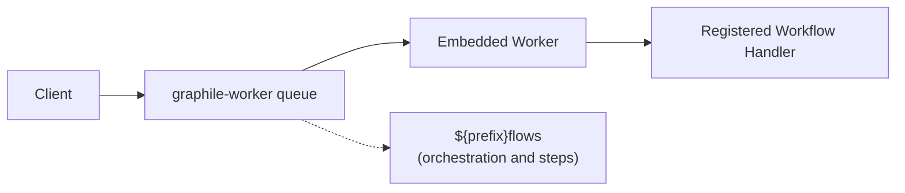

# How PostgreSQL World Works

This document explains the architecture and components of the PostgreSQL world implementation for workflow management.

This implementation is using [Drizzle Schema](./src/drizzle/schema.ts) that can be pushed or migrated into your PostgreSQL schema and backed by [node-postgres](https://node-postgres.com/) (`pg`). `createWorld` uses a single `pg.Pool` for Drizzle and graphile-worker (via `pgPool`), and a dedicated `pg.Client` for LISTEN/NOTIFY derived from the same connection options. You may pass your own pool to share query connections with application code.

If you want to use any other ORM, query builder or underlying database client, you should be able to fork this implementation and replace the Drizzle parts with your own.

## Job Queue System



Jobs include retry logic (3 attempts), idempotency keys, durable delayed rescheduling, and configurable worker concurrency (default: 50).

When the workflow runtime's generated flow route module loads, it calls `world.createQueueHandler(prefix, handler)`. The Postgres world stores that handler in a process-global registry and the embedded graphile-worker runner invokes it **directly in-process** for every job — there is no HTTP loopback, port detection, or base-URL configuration. The returned HTTP wrapper keeps the generated flow route functional (e.g. for health checks), but it is not on the job execution path.

When the handler returns `{ timeoutSeconds }`, the worker schedules a replacement Graphile job with a future `runAt` time (carrying the incremented logical attempt) before acknowledging the current one, so a crash cannot lose the wake-up.

## Streaming

Real-time data streaming via **PostgreSQL LISTEN/NOTIFY**:

- Stream chunks stored in `workflow_stream_chunks` table
- `pg_notify` triggers sent on writes to `workflow_event_chunk` topic
- Subscribers receive notifications and fetch chunk data
- ULID-based ordering ensures correct sequence
- One long-lived dedicated `LISTEN` client, with an in-process EventEmitter for distributing events to multiple subscribers

## Setup

Call `world.start()` to initialize graphile-worker. The runner begins consuming jobs only once a workflow handler is registered — jobs stay in PostgreSQL until the process can execute them, and a process that only enqueues (e.g. a CLI) never consumes. If `start()` was called and no handler registers within 10 seconds, a warning is logged.

Make sure the generated workflow route module is loaded in the worker process (it registers the handler as a module-load side effect), then call `world.start()`. In **Next.js**, do both from `instrumentation.ts|js`:

```ts
// instrumentation.ts
export async function register() {
  if (process.env.NEXT_RUNTIME === "nodejs") {
    // Registers the workflow handler as a side effect.
    await import("./app/.well-known/workflow/v1/flow/route");
    const { getWorld } = await import("workflow/runtime");
    await getWorld().then((world) => world.start?.());
  }
}
```

## Shutdown

`world.close()` first stops Graphile Worker from claiming new jobs, then waits for active jobs before closing the streamer and any internally owned pool.

Graphile Worker gives active tasks a grace period, then unlocks their job rows through its normal failure handling. The already-claimed delivery consumes an attempt and is retried only if its Graphile attempt budget remains; the shutdown handler does not insert a successor row. Unlocking a row does not stop the in-process handler that is still executing it, so workflow and step handlers need to tolerate at-least-once execution.

Applications that manage a broader shutdown sequence should set `WORKFLOW_POSTGRES_APPLICATION_MANAGED_SHUTDOWN=1` for the standard package target or `applicationManagedShutdown: true` for a programmatic World, await `world.close()`, and only then close any caller-owned pool. This prevents Graphile Worker's default handler from terminating the process as soon as its queue stops.
